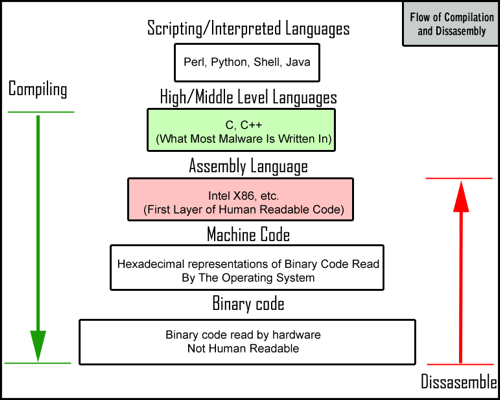
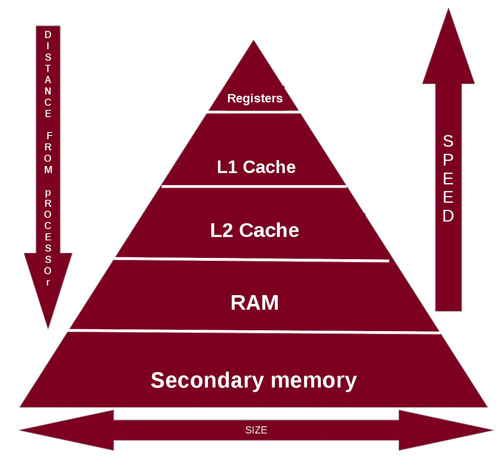
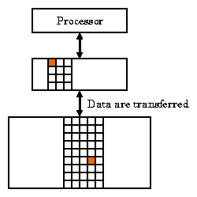

% Machine Structures Field Guide
% Written by Krishna Parashar
% with the humble help of Tomas Vega
% Published by [The OCM](http://ocm.io) on December 8th, 2013
\pagebreak

## Why This Exists
While taking my Machine Structures class I found it very difficult to conceptually understand and network the plethora of new found concepts. Thus I wrote up this brief synopsis of the concepts I found useful to understanding the core ideas. This is of course by no means **comprehensive** but I do hope it will provide you with a somewhat better understanding computer architecture. Please feel free to [email me](mailto:me@krishna.im) if you have an questions, suggestions, or corrections. Thanks and enjoy!

___
## Introduction
Okay, so you want to *understand* Machine Structures. But why in heaven's name to you want to take on this rather insurmountable task? I'll take a wild guess you may be forced into this by your universities’ curriculum task force-namely your professor. Despite the pain in frustration you *may* go through as you dive deeper, believe or not the ideas in this realm are actually quite useful in your everyday life. In fact the advances we have made in machine structures in the past thirty years are the reason the internet exists in the capacity we have grown to love. Because of this progress you can use things like *parallelism* and *pipelining* run an intensive Google search in milliseconds or execute massive projects like mapping the Human Genome to tailor medical care specifically to you. 

___
## The Big Picture
So chances are you have already tried a tiny bit of coding. But how does that virtual code turn in to physical phenomenon?  Well, let's start of by defining a few ideas in the computing lexicon:

- An **Operating System (OS)** is a interface between a your program and the hardware that manages the resources and ensures you can do things like use a keyboard, store data in memory, and handle many applications at once.

- A **Scripting Language** is probably what you did or want to learn first.  Python or Ruby or Java are pretty fun examples. These scripting languages are named so because they try to look like you are writing an essay (that actually *does* cool things) in a pretty logical and shorthand script. Want to print "hello" in Python? Here it is: `` print ("hello") ``! (Beautiful isn't it?)

- A **High Level Language** is something you may or may not have written before. Lisp, C, C++ are all higher level languages. They may not be as beautiful as the Python code, but boy oh boy can you make the program run really, really fast. That same hello statement from Python? Well in C it looks like:

>``     char string[] = "Hello World";``

>``     printf("%s \n", string);``

> (Now it's not as fun as before.)

- A **Compiler** is a program that parses (goes through) your complex C or C++ code and turns it into something that's harder for you to read, but easier for a computer to read. FYI though, a **compiler** is an umbrella term that can also mean turning that beautiful Python code to a more complicated C version, but more generally used to mean from C to an Assembly Language.

- An **Assembly Language** is the output from the compiler and looks like a funky short fragments such as:

> `` multi $t2 $t1 4 ``

> Don't worry if you don't understand what the above means. It is written in a language called **MIPS** that we will discuss later. It is worth mentioning that Intel has a very popular assembly language called **x86**, which can get quite complex and unfortunately will not be discussed in much detail in this guide.

- An **Instruction** is each one of those funky little fragments from the compiler.
 
- An **Assembler** is yet another program that takes in the assembly language and interprets that into something the *CPU* can read and execute.  
 
- The **Machine Language** is the output from the assembler looks quite intimidating. Here is an example of what adding two things looks like:

> `` 1000110010100000 ``

> Yep! You guessed it. Its binary! The CPU's structure (discussed lated) need the format to be in just 1's and 0's for reasons in the realm of mathematics and logic. Feel free to look it up, there is a lot of cool information about that.

- A **Binary Digit (Bit)** is well, the each one of those 1's and 0's. Each spot where you can have a digit contains a *bit* so if you have the above  machine language output, that would be 16 **bits**. Now you may be wondering, "Hey I have heard of a **Byte**, is that the same as a *bit*?" Good question!

- A **Byte** the what you call when you have a collection of 8 *bits*. So if you have the 16 bits of machine language we were talking about earlier, you can alternately say you have 2 **bytes** of machine language. Pretty cool huh? That 500 GB hard drive? 500 * 1,000,000,000 (from the *Giga* part) **bytes** or 500 * 1,000,000,000 * 8 (from the byte part) **bits**!

- A **Transistor** is the physical representation of the 0 or 1 bit. It is a physical digital *switch*. When it is flipped *ON* (current going through it) it used to mean a *1*, and when it is *OFF* (no current) it represents a *0*.

Phew! Now that that's out of the way, we can starting talking about some really useful and brilliant uses of these things.  Here is a quick visual summary:

___
## The Six Great Ideas in Computer Architecture
It is now that we come upon the *The Six Great Ideas in Computer Architecture* (so named due to their greatness). These topics will form the basis for the rest of this guide.

1. **Design processors using [Moore's Law](http://wikipedia.org/wiki/Moores_law)** which states processing speed and memory capacity will double every two years; an occurrence that is related to the number of transistors in the chip doubling. It was predicted by Gordon Moore in 1965, and has held roughly true thus far. 
	
2. **Abstract as much as possible in order to simplify the design.** This idea relates to what we talked about in the previous section. Split up the responsibility of understanding your code by using a standardized hierarchy (High Level Language -> Assembly Language -> Machine Level) so that each layer takes in an input and passes it down to the next layer. This process makes it infinitely easier to find out where things went or can go wrong. 

3. **Design so that the most common case is fast.** This one should be rather intuitive. Instead of wasting time, energy, and of course money trying to optimize so that every part of the program (down to the tiny edge cases) is blazing fast, why not  just make the most used cases faster? Otherwise you'll end up with a lot of code that is probably only trivially faster than if you just made the most often used cases faster.

4. **Make dependable systems by using redundancy.** This one is also rather intuitive. Basically you should make backups of the data and repeat the work with other parts of the computer system to ensure everything is accurate and dependable (nothing fails). 

5. **Use the capacities and speeds of different storage systems to make things fast.** This is actually one of the main ideas in this guide. We use this principal to optimize the usage of different kinds of memory (fast vs. slow, big vs. small)  to cleverly and thriftily use the resources and make our programs fast and light. 

6.  **Find ways to improve performance** using techniques such as **Parallelism,  Pipelining, and Prediction**. The techniques will also be discussed in greater detail later on. The basic idea for each is to have multiple parts of the computer to split up the work (**parallelism**), stage the processes so that no part of the computer has the excuse that it wasn't told what to do (**pipelining**),  and lastly try to predict where along the pipeline things might fail and proactively prevent those failures (**prediction**). 

With basically these ideas we have managed to come to where computers are today! Pretty impressive, isn't it?

___
## The Hardware Structure of A Computer
### Introduction
Now we want to try and understand how a modern computer is structured today. We will choose a relatively simple example, but don't fear if you don't understand what something is. All will come in due time! Thus we begin.

Talk about the components, CPU, SRAM, DRAM, Hard Disks, I/O 

___
## Memory Hierarchy

### Introduction
> *Ideally one would desire an indefinitely large memory capacity such that any particular... word would be immediately available. ... We are ... forced to recognize the possibility of constructing a hierarchy of memories, each of which has greater capacity that the preceding but which is less quickly accessible.*

#### Principle of Locality
Programs accesses a relatively portion of their address space at any instant of time. Locality in programs are common even in the simplest program structures. There are two different types of locality:

1. **Temporal Locality** (locality in time): If an item is referenced, it will tend to be referenced again soon
	* Ex. Loops: Instructions and data are likely to be accessed repeatedly
2. **Spatial Locality** (locality in space): If an item is referenced, items whose addresses are close by will tend to be referenced soon
	* Ex. Loops: Instructions are normally accessed sequentially. Another example is sequential access of array elements

___

#### Memory Hierarchy

- **Definition**: A structure that uses multiple levels of memories with different speeds and sizes
- **Purpose**: Present the user with as much memory as is available in the cheapest technology, while providing access at the speed offered by the fastest memory
- As the distance from the processor increases, both the size and access time of memories increase
- Data is similarly hierarchical: a level closer to the processor is generally a subset of any level further away, and all the data is stored at the lowest level

##### How Memory Hierarchy takes advantage of the Principle of Locality
- **Temporal Locality**: Keeps more recently accessed data items closer to the processor
-  **Spatial Locality**: Moving blocks consisting of multiple contiguous 

Memory Hierarchy uses smaller and faster memory technologies close to the processor. Thus, accesses that hit in the highest level of the hierarchy can be processed quickly. Accesses that miss go to lower levels of the hierarchy which are larger but slower.

##### Memory Access
A memory hierarchy can consist of multiple levels, but data is copied between only two adjacent levels at a time. Thus, to convey memory access in its simplest form only two levels will be analyzed.

**Block (Line)**: The minimum unit of information that can be either present or not present in cache. This is shown in the image above as the red square.

Every pair of levels in the memory hierarchy can be thought of as having an:

- **Upper Level**: 
	- Closer to the processor
	- Smaller, faster, and more expensive than the lower level
	- Data in this level is generally a subset of the lower level
- **Lower Level**

##### Important Keywords

- *Hit*: When data requested by the processors is found in some block in the upper level
- *Hit Rate*: Fraction of memory accesses found in a level of the memory hierarchy
- *Hit Time*: Time required to access a level of the memory hierarchy, including the time needed to determine whether the access time is a hit or a miss
- *Miss*: When data requested by the processor is not found in the upper level -> lower level accessed to retrieve the block containing the requested data
- *Miss Rate*: Fraction of memory accesses not found in a level of the memory hierarchy (1 - Hit Rate)
- *Miss Penalty*: Time required to fetch a block into a level of the memory hierarchy from the lower level, including
	- time to access the block
	- transmit it from one level to the other
	- insert it in the level that experienced the miss
	- pass the block to the requestor

* * *

### Memory Technologies

Four Memory Technologies used today in Memory Hierarchies

Memory Technology	|	Typical Access Time (ns)		|	$ per GiB in 2012
-----------------------------	|	----------------------------------		|	-------------------------
SRAM								|	0.5-2.5									|	500-1000
DRAM								|	50-70										|	10-20
Flash								|	5,000-50,000						|	0.75-1.00
Magnetic Disk				|	5,000,000-20,000,000		|	0.05 - 0.10

#### SRAM Technology

- Static Random Access Memory
- Integrated circuits that form memory arrays 
- Usually has a single access port that can provide either a read or a write
- Fixed access time to any datum (read/write access times may differ)
- Typically uses 6-8 transistors per bit to prevent information disruption when read
- As long as power is applied the value can be kept indefinitely

#### DRAM Technology

- Dynamic Random Access Memory
- Value keep in a cell is stored as a charge in a capacitor
- Single transistor is used to access stored charge (either to read or overwrite the stored charge)
	- Because it uses one transistor per bit of storage, it is much denser and cheaper than SRAM
- Stores charge on a capacitor: it cannot be kept indefinitely and must be periodically refreshed
- *Refresh*: contents from an entire row are read and immediately written back to the same row

##### Performance Specifications
- Buffer Rows:	
	- Acts like a SRAM: changing the address enables random bits access to be accessed until the next row is accessed
- Wider Chips:
	- Improves memory bandwidth
- Organization:
	- Modern DRAMs are organized in banks
	- *Bank*: Series of rows
		* Pre-charge opens/closes a bank
	- DDR3: 4 banks
	- *Act *: Signal sent with row addresses that activates the transfer of the row to the buffer
	- When row is in the  buffer, it can be transferred by
		- Successive column addresses at whatever the width of the DRAM is (typically 4, 8 or 16)
		- Specifying a block transfer and the starting address
- Clocks Added:
	- SDRAM (Synchronous DRAM)
	- Eliminates synchronization time between memory and processor
	- Speed Advantage: transfers bits in the burst without having to specify additional address bits
	- DDR SDRAM (Double Data Rate):
		- Data transfers on both the rising and falling edge of the clock (twice bandwidth)
		- Latest version: DDR4 can do 3200 million transfers per second (1600 MHz clock)
- Address Interleaving
	- Instead of just a faster row buffer, DRAM can read from or write to multiple banks, each having its own row buffer
	- Accesses rotation: Enables sending addresses to several banks to read/write simultaneously
	- Bandwidth = Bandwidth x (# of banks)

#### Flash Memory

- A type of EEPROM (Electrically Erasable Programmable Read-Only Memory)
- Wear Leveling
	- Like other EEPROM technologies, writes can wear out flash memory bits
	- To handle this a controller is used to spread the writes by remapping blocks that have been written many times to less used blocks
	- With this technology mobile devices are very unlikely to exceed flash's write limits
	- To improve performance even more, incorrectly manufactured memory cells are mapped out
	- Wear Leveling lowers flash's potential performance, but is needed unless higher-level software monitors block wear

#### Disk Memory

- Magnetic Hard Disks consist of a collection of platters
- Metal platters are covered with magnetic recording material on both sides
- Track: One of thousands of concentric circles that makes up the surface of a magnetic disk
- Sector: 
	- One of the segments that make up a track on a magnetic disk
	- The smallest amount of information that is read/written on a disk
- Read/Write mechanism
	- Read-Write Head: Movable arm containing a small electromagnetic coil
	- Each surface has one arm containing two RW-Heads, one facing up and one facing down

- - -

### Caches

#### Measuring Cache

#### Improving Cache Performance

#### Measuring 

### Structure
Registers,  Etc.

### Direct Mapped Caches

### Multilevel Caches 

###  AMAT

### Flynn Taxonomy

### Shared Memory

### Virtual Memory

___
## Machine Instructions
### Introduction
### MIPS
Basics MIPS stuff e.g. how it works, instructions, link to green sheet, and uses
Converting Binary to MIPS, Parity Bits, and those table things and everything. CS61C Winston's Discussion will be helpful.

___
## Binary Representations
### Introduction
Signed, Unsigned, Two's Complement, Hex, Conversions, Extensions etc.

___
## The CPU
### Structure
Purpose? Multiprocessing
### Performance 
CPU Time, CPI, Instruction Count, Clock Cycle time?

___
## Hardware Level
### Introduction
Assembly to Machine, Logic Gates, 
[Useful Processor Stuff](https://www.cise.ufl.edu/~mssz/CompOrg/CDA-proc.html)

___
## Code Optimization Techniques
### Introduction
### Cache Blocking
### Pipelining
Lead to next section : Parallelism

___
## Parallelism
### Introduction
### Amdahl's Law
### Request Level Parallelism 
#### Application: MapReduce
### Data Level Parallelism 
### Thread Level Parallelism
### Application: OpenMP (?)
### Instruction Level Parallelism
### Application: Warehouse Scale Computing

## Redundancy 
ECC, RAID, Stuff from Professor Katz's lecture.  

## Virtual Machines (?)

___
## Colophon
Written by [Krishna Parashar](http://krishna.im) in Markdown on Byword. Used [Pandoc](http://johnmacfarlane.net/pandoc/) to convert from Markdown to Latex. 